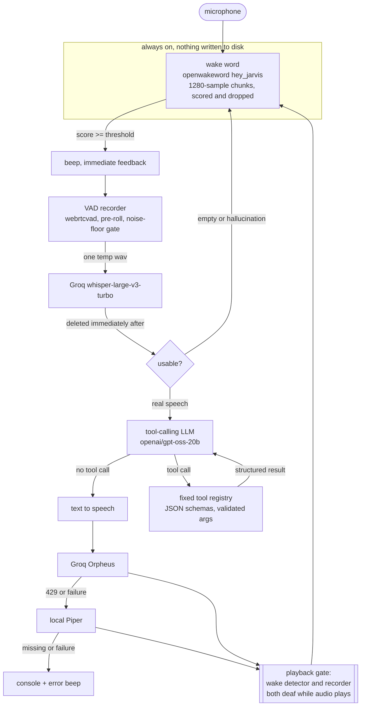

# AzizGPT

A background voice assistant for Linux that runs entirely on hosted inference, with a security model designed around the assumption that the speech recogniser will occasionally hear things that were never said.

It listens for a wake word, records until you stop talking, transcribes, decides whether the request maps to a tool, runs it, and answers out loud. Speech-to-text, the language model, and text-to-speech all go through Groq's OpenAI-compatible API on a single key. There is no local language model. Idle memory is about 145 MB, which matters because the machine it was built for has 8 GB and usually a VM running.

The interesting part is not that it works, it is what happens when it mishears. Whisper hallucinates fluent sentences out of room noise. A voice assistant that can launch programs and power off a machine has to be built expecting that, so the model is confined to a fixed set of enumerated tools with validated arguments, never a shell, and anything destructive requires a spoken confirmation whose accepted words are chosen specifically to exclude what Whisper invents from silence.

---

## Quickstart

Requires Python 3.11+ and a working PipeWire or PulseAudio setup.

```bash
# 1. System dependencies (Debian/Ubuntu/Kali)
sudo apt install -y python3-full portaudio19-dev ffmpeg libnotify-bin

# 2. Clone and set up
git clone https://github.com/azizollahpayandeh/AzizGPT.git
cd AzizGPT
python3 -m venv .venv
source .venv/bin/activate
pip install -r requirements.txt

# 3. Add your key. Free tier is enough to try it.
#    Get one at https://console.groq.com/keys
cp .env.example .env
$EDITOR .env          # set GROQ_API_KEY=gsk_...

# 4. Confirm the key works and the configured models still exist
python -m azizgpt.main --check-providers
```

Then run it, starting with the mode that needs no microphone:

```bash
python -m azizgpt.main --text          # type commands, no mic, no speech
python -m azizgpt.main --text --speak  # type commands, spoken answers
python -m azizgpt.main --listen        # press Enter to talk
python -m azizgpt.main --wake          # always on, say "hey jarvis"
```

For offline speech, download a Piper voice once:

```bash
mkdir -p ~/.local/share/piper && cd ~/.local/share/piper
curl -LO https://huggingface.co/rhasspy/piper-voices/resolve/main/en/en_US/lessac/medium/en_US-lessac-medium.onnx
curl -LO https://huggingface.co/rhasspy/piper-voices/resolve/main/en/en_US/lessac/medium/en_US-lessac-medium.onnx.json
```

The path is read from `tts.piper.model` in `config.yaml`, so put it wherever you like.

### Try it without a microphone

`--text` exercises the whole brain and tool layer with no audio hardware at all. `--dry-run` additionally validates every tool call without launching anything:

```bash
python -m azizgpt.main --text --dry-run --verbose
```

---

## Architecture



Files map onto that pipeline directly:

| Module | Responsibility |
| --- | --- |
| `azizgpt/wakeword.py` | openwakeword loop, lean ONNX sessions, playback gating |
| `azizgpt/recorder.py` | VAD-gated capture, pre-roll, adaptive noise-floor rejection |
| `azizgpt/stt.py` | Groq Whisper, local faster-whisper fallback, clip deletion |
| `azizgpt/brain.py` | provider router, streaming, tool-calling loop, system prompt |
| `azizgpt/tools/` | the entire set of things the model can do |
| `azizgpt/tts.py` | Orpheus, Piper, console fallback; serialised playback |
| `azizgpt/gate.py` | the shared "audio is playing" flag |
| `azizgpt/single_instance.py` | one daemon per machine |

`docs/ARCHITECTURE.md` goes deeper on the gate, the recorder's noise-floor logic, and the provider state machine.

---

## Provider fallback

Providers are an ordered list in `config.yaml`. Each has a `name`, `base_url`, `api_key_env`, `model` and `enabled` flag. The first enabled provider that is not currently marked dead handles the request. An OpenRouter entry ships disabled as a template.

The two kinds of 429 are handled differently, because they mean different things:

| Response | Handling |
| --- | --- |
| Per-minute rate limit | Sleep for `retry-after` (capped by `llm.max_retry_sleep`) and retry the same provider, up to `llm.rate_limit_retries` times. |
| Daily quota (TPD/RPD) | Mark the provider dead, persist that to `~/.local/state/azizgpt/providers.json`, and move down the chain. A restart does not re-hammer an exhausted provider. |

The dead-until time is `min(local midnight, now + retry-after)`. Groq's per-day token bucket refills continuously and the 429 says when, so benching a provider until midnight over a few minutes of backoff costs far more than it saves. This was not theoretical: during development the LLM sat marked-dead-until-midnight while the API was returning 200.

Every provider switch is logged at INFO.

The same logic guards text-to-speech under its own state key, so a spent Orpheus quota falls through to Piper for the rest of the window without re-paying the round trip on every turn.

---

## Tools

The model cannot do anything that is not in this table.

| Tool | Arguments | Behaviour |
| --- | --- | --- |
| `open_app` | `app_key` (enum) | Launches an allowlisted desktop app. The key maps to an exact argv list in `config.yaml`. Unknown keys are refused. |
| `open_url` | `url` | Opens a site in the configured browser. Bare names are completed locally (`youtube` becomes `https://youtube.com`). http/https only. |
| `open_email` | none | Opens the configured webmail URL. No OAuth, no mail API. |
| `get_time` | none | Local time and date. |
| `get_weather` | `city` (optional) | Open-Meteo. No API key. Defaults to `weather.default_city`. |
| `set_alarm` | `when`, `label` | Schedules a desktop notification via a transient systemd user timer. The model supplies a timestamp only. |
| `power_action` | `action` (enum) | `shutdown`, `restart` or `sleep`. The first two require spoken confirmation. |

Anything that is not a tool call is answered directly and spoken back.

---

## Configuration

Everything tunable lives in `config.yaml`. Model names are never hardcoded, because free-tier catalogs rotate; `--check-providers` tells you which configured models actually exist.

| Key | Default | Purpose |
| --- | --- | --- |
| `providers[]` | groq enabled, openrouter disabled | Ordered fallback chain |
| `llm.model` | `openai/gpt-oss-20b` | Also supports `openai/gpt-oss-120b` |
| `llm.stream` | `true` | Stream completions |
| `llm.max_tool_iterations` | `4` | Guard against tool-call ping-pong |
| `llm.rate_limit_retries` | `3` | Per-minute 429 retries |
| `llm.history_turns` | `6` | Rolling conversation memory |
| `stt.model` | `whisper-large-v3-turbo` | Speech to text |
| `stt.min_transcript_chars` | `2` | Below this is treated as silence |
| `tts.model` | `canopylabs/orpheus-v1-english` | Voices: autumn, diana, hannah, austin, daniel, troy |
| `tts.voice` | `daniel` | |
| `tts.stream_sentences` | `false` | One synthesis call per answer when off |
| `tts.piper.model` | `~/.local/share/piper/en_US-lessac-medium.onnx` | Local fallback voice |
| `wakeword.model` | `hey_jarvis` | Drop a custom `.onnx` in `models/` and name it here |
| `wakeword.threshold` | `0.7` | Raise if it false triggers, lower if it misses |
| `wakeword.mute_during_playback` | `true` | Stops it hearing itself |
| `wakeword.post_playback_mute` | `1.0` | Measured, not guessed — see `scripts/calibrate_echo.py` |
| `wakeword.disable_onnx_arena` | `true` | Saves ~120 MB, identical detection scores |
| `wakeword.skip_trainer_import` | `true` | Keeps scipy and sklearn out, ~78 MB |
| `recorder.vad_aggressiveness` | `2` | 0 lenient, 3 strict |
| `recorder.speech_over_floor` | `3.0` | Speech must exceed the room's noise floor by this factor |
| `apps` | chrome, firefox, vm, terminal, files | The complete launch allowlist |
| `web.default_browser` | `chrome` | Must be a key from `apps` |
| `power.enabled` | `true` | Set false to remove the power tool |
| `power.confirm_timeout_s` | `8` | One listen, no re-asking |
| `power.countdown_s` | `5` | Ctrl-C aborts during this |

---

## Security design

This is the part of the project worth reviewing. The threat model is not a malicious user; it is an unreliable input channel wired to a machine.

**The model can never execute an arbitrary command.** There is no shell tool, no `eval`, no `exec`, and no code path where model output reaches a shell. Every subprocess in the codebase is invoked with an argv list. `shell=True` appears nowhere.

**Tools are a fixed, enumerated set with JSON schemas.** The model chooses a name from a registry and supplies arguments the schema declares. Every tool re-validates its own arguments regardless of what the schema allowed, because a schema is a hint to the model, not an enforcement boundary.

**Application launching is allowlist-only.** `open_app` takes a friendly key — `chrome`, `vm`, `terminal` — which is looked up in a map in `config.yaml` to get an exact argv list. The model never supplies a binary name or a path. A key that is not in the map is refused out loud. The schema's enum is a first line of defence; the runtime lookup is the actual one.

**Browser launching does not trust the environment.** Python's `webbrowser` module decides what browsers exist from `DISPLAY` and `PATH`, returns False in environments that have neither, and reports success it cannot verify. It was replaced with a direct launch through the same allowlist, with the process polled to confirm it survived.

**Destructive actions require spoken confirmation, and the accepted words are the point.** `power_action` asks out loud, listens once for up to 8 seconds, and proceeds only on a clear affirmative. The accepted set is `yes`, `yes please`, `yeah`, `yep`, `yup`, `confirm`, `confirmed`, `do it`, `go ahead`, `affirmative`. It deliberately excludes **"ok", "okay" and "sure"** — all three are things Whisper invents out of silence, observed in this project. Anything not in the set cancels, including a timeout, a misheard reply, and silence. It never asks twice. After confirming there is a five second countdown, logged once a second, so Ctrl-C still aborts.

**Confirmation cannot be bypassed by the absence of a voice.** If no speaking and listening pair is wired in — `--text` mode, the test harness — the tool refuses anything needing confirmation rather than assuming consent.

**The microphone is discarded frame by frame.** While waiting for the wake word, audio is read one 1280-sample chunk at a time, scored, and dropped. Nothing is buffered and nothing reaches disk. Only the clip captured after the wake word fires is written to a temp file, and it is deleted in a `finally` block as soon as the transcription call returns, whether it succeeded or not.

**Silence does not reach the model.** The recorder measures the room's own noise floor while it waits and rejects audio that is not meaningfully louder. Known Whisper silence hallucinations (`"you"`, `"Thank you."`, `"Thanks for watching!"`) are dropped by name before a model call is made.

**One daemon per machine.** Two `--wake` processes sharing a microphone both hear the wake word, both answer, and both speak about a second apart — and each one's recorder captures the other's voice. From inside either process that is indistinguishable from a playback bug. An advisory `flock` makes it impossible; a second start is refused with the pid to kill.

**Keys come from `.env` only.** They are never printed and never logged. A malformed key is reported by shape ("contains non-ASCII characters"), never by value. `.env` overrides the shell environment, because a stale exported variable silently shadowing the file cost hours during development.

**The model's reasoning is never spoken.** `openai/gpt-oss-*` returns a separate `reasoning` field alongside `content`. Only `content` is ever read, stored, or sent to text-to-speech.

**Tool results are structured so they cannot be embellished.** `open_url` and `power_action` return JSON (`ok` plus a url, or `ok` plus a reason). The system prompt forbids inventing a reason for a failure or explaining one by claiming something is closed or not running unless the result says so.

There are no destructive tools beyond `power_action`: nothing deletes, nothing sends messages, nothing spends money.

---

## Limitations

Stated plainly, because they are real:

- **No speaker identification.** The assistant cannot tell your voice from a video playing in the room. Ambient speech will trigger it and can be transcribed as a command. Set `wakeword.threshold` higher if this bites.
- **No barge-in.** You cannot interrupt it mid-answer. The countdown before a power action is the only interruptible moment, and only from the terminal.
- **Orpheus free tier is 3600 tokens per day.** That is roughly a few dozen spoken answers. After that it falls through to Piper, which is why Piper is wired in rather than optional. The LLM tier is 200k tokens/day, which a full test-harness run consumes about a third of.
- **English only.** The system prompt, the wake word model, the Whisper language pin and the Piper voice are all English.
- **No echo cancellation.** The playback gate stops the assistant hearing *itself*; it does nothing about other audio in the room.
- **Bluetooth speakers add latency.** Perceived latency measured 3.3–5.4 seconds from wake word to first audio, of which the biggest single component is text-to-speech synthesis.
- **Alarms survive a restart, not a reboot.** systemd holds the timer; the JSON file lets timers be recreated at startup.

---

## Troubleshooting

Every item here was hit during development.

**It answers, then immediately wakes itself up.** Its own voice is reaching the microphone. Confirm `wakeword.mute_during_playback: true`, then calibrate the tail for your hardware:

```bash
python scripts/calibrate_echo.py            # measure and recommend
python scripts/calibrate_echo.py --write    # write it into config.yaml
```

Run it in a quiet room with nothing else playing, or it measures the room instead of your speakers.

**Answers play twice, about a second apart.** Two daemons are running. Newer builds refuse the second start; if you are on an older one, `pgrep -af azizgpt.main` and kill the extra.

**Everything fails with `could not locate runnable browser` or a proxy error.** If your shell exports `all_proxy=socks://...`, that scheme is invalid and the HTTP layer raises before any request is made. Use `socks5://` (with `pip install socksio`) or an `http://` proxy. AzizGPT resolves one usable proxy explicitly rather than letting the client read the environment, so `HTTPS_PROXY` alone is enough.

**`error: externally-managed-environment` on Kali or Debian.** That is pip refusing to touch the system Python. Use the virtualenv from the quickstart; do not pass `--break-system-packages`.

**`model_terms_required` from the TTS endpoint.** Some Groq models need a one-time terms acceptance in the console before the API will serve them. Open the model in <https://console.groq.com/playground>, accept, and retry. Speech falls through to Piper until you do.

**`ModuleNotFoundError: No module named 'pkg_resources'`.** `webrtcvad` still imports it and setuptools 81 removed it. `requirements.txt` pins `setuptools<81`.

**It transcribes silence as "." or "Thank you." and answers it.** The noise-floor gate is not tuned for your room. Raise `recorder.speech_over_floor`.

**Memory.** `python -m azizgpt.main --mem` prints a per-component breakdown plus what the running service is using.

---

## Development

```bash
python scripts/test_tools.py             # 23 command harness, dry-run, prints SCORE
python scripts/test_tools.py --self-test # checks the scorer itself, no API calls
python -m azizgpt.main --mem             # memory breakdown
```

The harness fires 23 phrases at the model and checks that each produces the correct tool call, the correct arguments, or correctly produces none. Refusal cases pass only if no tool call is emitted. It always runs dry: arguments are fully validated but nothing launches, opens a tab, schedules a timer, or powers anything off.

A full run costs roughly a third of the Groq free daily token budget, so it is not a per-commit check.

---

## License

MIT. See [LICENSE](LICENSE).

<!--
Repository settings to apply on GitHub (Settings → General, and the ⚙ next to
"About" on the repo home page).

Description (350 char limit, this is 208):
  Background voice assistant for Linux. Wake word, VAD-gated capture, Groq
  Whisper, tool-calling LLM, Orpheus with a local Piper fallback. Allowlist-only
  tool layer, no shell access, spoken confirmation for destructive actions.

Website:
  (leave empty, or link docs/ARCHITECTURE.md)

Topics:
  voice-assistant, speech-recognition, wake-word, text-to-speech, groq,
  whisper, llm, tool-calling, function-calling, openwakeword, piper-tts,
  python, linux, systemd, security, offline-fallback

Suggested settings:
  - Issues: on
  - Discussions: off
  - Wiki: off
  - Projects: off
  - "Require status checks to pass" on main once CI has run once
-->
